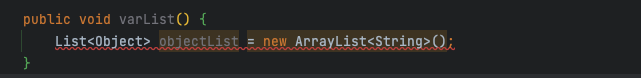

# boot启动器

## MybatisAutoConfiguration类

<figure><figcaption></figcaption></figure>

这里的bean方法可以看出，自动配置类主要向容器中注入两个核心类：`SqlSessionFactory` 与 `SqlSessionTemplate`&#x20;

```java
@Bean
@ConditionalOnMissingBean
public SqlSessionFactory sqlSessionFactory(DataSource dataSource) throws Exception {
    // 将使用 SqlSessionFactoryBean 创建并注册一个 SqlSessionFactory 的实例，并将探测到的 DataSource 作为数据源
    SqlSessionFactoryBean factory = new SqlSessionFactoryBean();
    // 1.自动探测存在的 DataSource
    factory.setDataSource(dataSource);
    factory.setVfs(SpringBootVFS.class);
    if (StringUtils.hasText(this.properties.getConfigLocation())) {
        factory.setConfigLocation(this.resourceLoader.getResource(this.properties.getConfigLocation()));
    }
    applyConfiguration(factory);
    if (this.properties.getConfigurationProperties() != null) {
        factory.setConfigurationProperties(this.properties.getConfigurationProperties());
    }
    if (!ObjectUtils.isEmpty(this.interceptors)) {
        factory.setPlugins(this.interceptors);
    }
    if (this.databaseIdProvider != null) {
        factory.setDatabaseIdProvider(this.databaseIdProvider);
    }
    if (StringUtils.hasLength(this.properties.getTypeAliasesPackage())) {
        factory.setTypeAliasesPackage(this.properties.getTypeAliasesPackage());
    }
    if (this.properties.getTypeAliasesSuperType() != null) {
        factory.setTypeAliasesSuperType(this.properties.getTypeAliasesSuperType());
    }
    if (StringUtils.hasLength(this.properties.getTypeHandlersPackage())) {
        factory.setTypeHandlersPackage(this.properties.getTypeHandlersPackage());
    }
    if (!ObjectUtils.isEmpty(this.typeHandlers)) {
        factory.setTypeHandlers(this.typeHandlers);
    }
    if (!ObjectUtils.isEmpty(this.properties.resolveMapperLocations())) {
        factory.setMapperLocations(this.properties.resolveMapperLocations());
    }
    Set<String> factoryPropertyNames = Stream
            .of(new BeanWrapperImpl(SqlSessionFactoryBean.class).getPropertyDescriptors()).map(PropertyDescriptor::getName)
            .collect(Collectors.toSet());
    Class<? extends LanguageDriver> defaultLanguageDriver = this.properties.getDefaultScriptingLanguageDriver();
    if (factoryPropertyNames.contains("scriptingLanguageDrivers") && !ObjectUtils.isEmpty(this.languageDrivers)) {
        // Need to mybatis-spring 2.0.2+
        factory.setScriptingLanguageDrivers(this.languageDrivers);
        if (defaultLanguageDriver == null && this.languageDrivers.length == 1) {
            defaultLanguageDriver = this.languageDrivers[0].getClass();
        }
    }
    if (factoryPropertyNames.contains("defaultScriptingLanguageDriver")) {
        // Need to mybatis-spring 2.0.2+
        factory.setDefaultScriptingLanguageDriver(defaultLanguageDriver);
    }
    applySqlSessionFactoryBeanCustomizers(factory);
    return factory.getObject();
}
```

> tips：
>
> * 从源码中可以看出，在默认不配置SqlSessionFactory时，自动配置将会在容器中自动注入bean：sqlSessionFactory
> * 这里的数据源DataSource是Spring配置的数据源
> * SqlSessionFactory是采用FactoryBean接口实现的方式产生
> * 各个注入SqlSessionFactoryBean factory的含义

<figure><figcaption></figcaption></figure>

```java
// 将创建并注册一个从 SqlSessionFactory 中得到的 SqlSessionTemplate 的实例
@Bean
@ConditionalOnMissingBean
public SqlSessionTemplate sqlSessionTemplate(SqlSessionFactory sqlSessionFactory) {
    ExecutorType executorType = this.properties.getExecutorType();
    if (executorType != null) {
        return new SqlSessionTemplate(sqlSessionFactory, executorType);
    } else {
        // 默认executorType：ExecutorType.SIMPLE
        return new SqlSessionTemplate(sqlSessionFactory);
    }
}
```

> tips：
>
> * 这里的SqlSessionTemplate默认ExecutorType.SIMPLE


## AutoConfiguredMapperScannerRegistrar类

<figure><figcaption></figcaption></figure>

> tips：
>
> * 主要负责扫描`@Mapper` 注解标记的接口，默认扫描路径是spring-boot启动类所在的根路径。使得mybatis开箱即用，类似于JPA的`@Respority` 注解功能
> * 只负责注册beanDefinition

```java
public static class AutoConfiguredMapperScannerRegistrar implements BeanFactoryAware, EnvironmentAware, ImportBeanDefinitionRegistrar {
    private BeanFactory beanFactory;
    private Environment environment;

    @Override
    public void registerBeanDefinitions(AnnotationMetadata importingClassMetadata, BeanDefinitionRegistry registry) {

        if (!AutoConfigurationPackages.has(this.beanFactory)) {
            logger.debug("Could not determine auto-configuration package, automatic mapper scanning disabled.");
            return;
        }

        logger.debug("Searching for mappers annotated with @Mapper");
        // 获取容器根路径
        List<String> packages = AutoConfigurationPackages.get(this.beanFactory);
        if (logger.isDebugEnabled()) {
            packages.forEach(pkg -> logger.debug("Using auto-configuration base package '{}'", pkg));
        }

        BeanDefinitionBuilder builder = BeanDefinitionBuilder.genericBeanDefinition(MapperScannerConfigurer.class);
        builder.addPropertyValue("processPropertyPlaceHolders", true);
        builder.addPropertyValue("annotationClass", Mapper.class);
        builder.addPropertyValue("basePackage", StringUtils.collectionToCommaDelimitedString(packages));
        BeanWrapper beanWrapper = new BeanWrapperImpl(MapperScannerConfigurer.class);
        Set<String> propertyNames = Stream.of(beanWrapper.getPropertyDescriptors()).map(PropertyDescriptor::getName).collect(Collectors.toSet());
        if (propertyNames.contains("lazyInitialization")) {
            // Need to mybatis-spring 2.0.2+
            builder.addPropertyValue("lazyInitialization", "${mybatis.lazy-initialization:false}");
        }
        if (propertyNames.contains("defaultScope")) {
            // Need to mybatis-spring 2.0.6+
            builder.addPropertyValue("defaultScope", "${mybatis.mapper-default-scope:}");
        }

        // for spring-native
        boolean injectSqlSession = environment.getProperty("mybatis.inject-sql-session-on-mapper-scan", Boolean.class,Boolean.TRUE);
        if (injectSqlSession && this.beanFactory instanceof ListableBeanFactory) {
            ListableBeanFactory listableBeanFactory = (ListableBeanFactory) this.beanFactory;
            Optional<String> sqlSessionTemplateBeanName = Optional.ofNullable(getBeanNameForType(SqlSessionTemplate.class, listableBeanFactory));
            Optional<String> sqlSessionFactoryBeanName = Optional.ofNullable(getBeanNameForType(SqlSessionFactory.class, listableBeanFactory));
            if (sqlSessionTemplateBeanName.isPresent() || !sqlSessionFactoryBeanName.isPresent()) {
                builder.addPropertyValue("sqlSessionTemplateBeanName", sqlSessionTemplateBeanName.orElse("sqlSessionTemplate"));
            } else {
                builder.addPropertyValue("sqlSessionFactoryBeanName", sqlSessionFactoryBeanName.get());
            }
        }
        builder.setRole(BeanDefinition.ROLE_INFRASTRUCTURE);

        registry.registerBeanDefinition(MapperScannerConfigurer.class.getName(), builder.getBeanDefinition());
    }

    @Override
    public void setBeanFactory(BeanFactory beanFactory) {
        // 容器感知
        this.beanFactory = beanFactory;
    }

    @Override
    public void setEnvironment(Environment environment) {
        // 环境感知
        this.environment = environment;
    }

    private String getBeanNameForType(Class<?> type, ListableBeanFactory factory) {
        String[] beanNames = factory.getBeanNamesForType(type);
        return beanNames.length > 0 ? beanNames[0] : null;
    }

}
```

## 总结

mybatis的自动配置，完成三件事

1. 注入SqlSessionFactory
2. 注入SqlSessionTemplate
3. 自动扫描`@Mapper` 注解标记的接口
