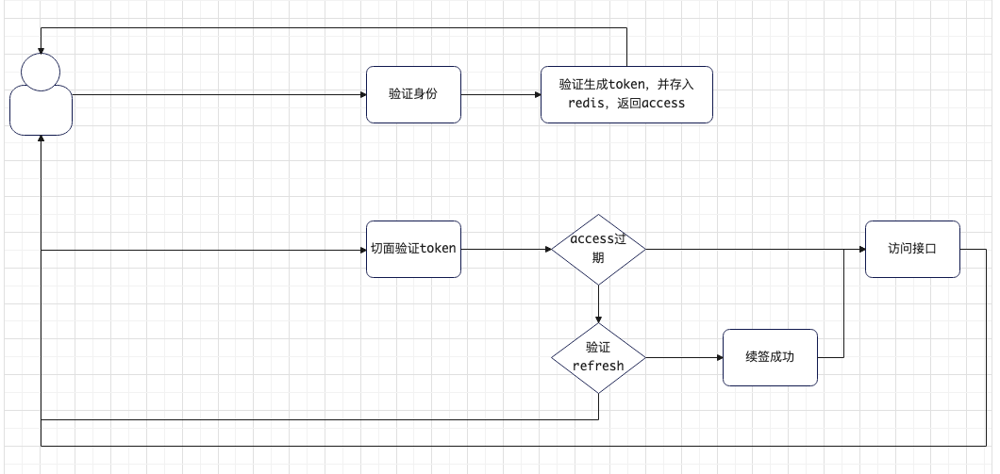

# 依赖注入DI

##

## Q\&A

> Q：构造器注入与setter注入是按照类型注入还是按照bean名称注入？

A：在（构造器或setter方法）参数名称**与容器内bean名称**_**一致时**_**按照名称注入**，_**不一致时**_**按照类型注入**

> Q：构造器与setter注入的选择？

A：构造器注入为主，setter注入为辅。并且针对第三方不暴露setter的情况，只能选择构造器注入

> Q：@Autowired与@Resource区别

A：@Autowired只支持案例类型注入，可搭配@Qualifier实现按名称注入。@Resource默认按名称注入，同时支持按类型注入。

## 案例

一个接口，多个实现，依赖注入时，具体情况

<figure><figcaption><p>用户查询接口</p></figcaption></figure>

```java
public interface SysUserQueryService {
    List<String> getSysUserList();
}
```

> 数据库查询实现

```java
@Service
public class SQLQueryServiceImpl implements SysUserQueryService {
    @Override
    public List<String> getSysUserList() {
        return Collections.singletonList("SQLQueryServiceImpl");
    }
}
```

> 缓存查询实现

```java
@Service
public class CacheQueryServiceImpl implements SysUserQueryService {
    @Override
    public List<String> getSysUserList() {
        return Collections.singletonList("CacheQueryServiceImpl");
    }
}
```

## 构造器注入(SysUserQueryService)

基于注解形式

```java
@Component
public class SysUserQueryFacadeImpl {
    private final SysUserQueryService sysUserQueryService;

    public SysUserQueryFacadeImpl(SysUserQueryService SQLQueryServiceImpl) {
        this.sysUserQueryService = SQLQueryServiceImpl;
    }
}
```

## setter注入(SysUserQueryService)

@Autowired + setter

```java
@Component
public class SysUserQueryFacadeImpl {
    private SysUserQueryService sysUserQueryService;

    @Autowired
    public void setSQLQueryServiceImpl(SysUserQueryService cacheQueryServiceImpl) {
        this.sysUserQueryService = cacheQueryServiceImpl;
    }
}
```

## 注解注入（@Resource、@Autowired）

```java
@RunWith(SpringRunner.class)
@SpringBootTest(classes = SpringEcosystemApplication.class)
public class SpringEcosystemApplicationTests {
    @Resource(name = "cacheQueryServiceImpl")
    private SysUserQueryService sysUserQueryService1;

    @Autowired
    @Qualifier("cacheQueryServiceImpl")
    private SysUserQueryService sysUserQueryService2;

    @Test
    public void injection() {
        System.out.println(sysUserQueryService1.getSysUserList());
        System.out.println(sysUserQueryService2.getSysUserList());
    }
}
```
